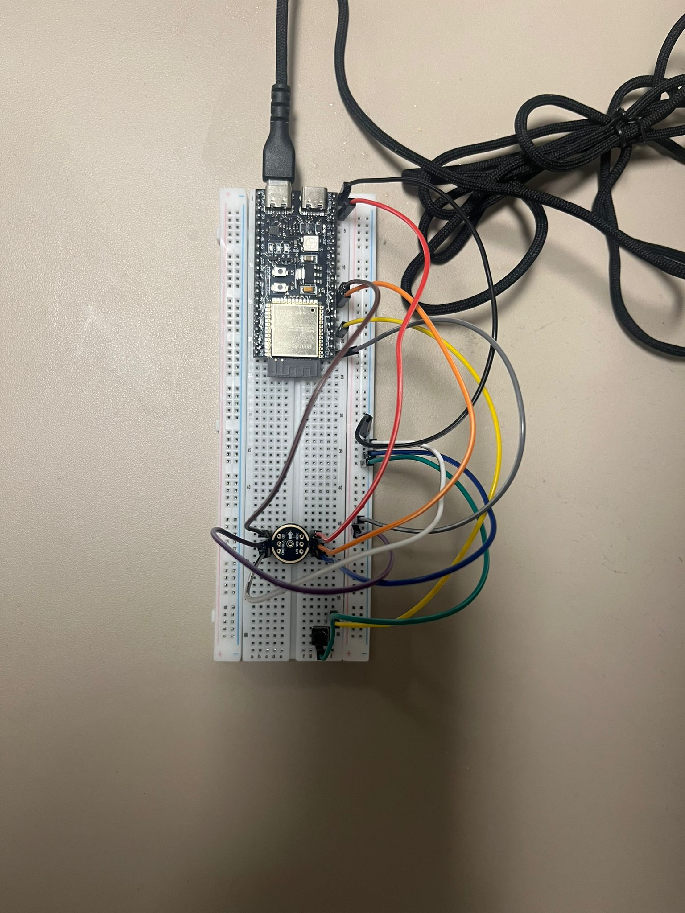
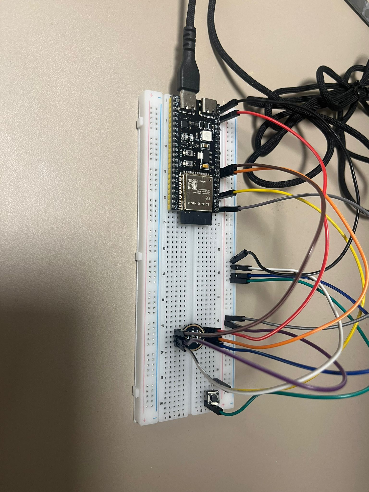

# Adaptif Arac Ses Sistemi

ESP32-S3, INMP441 I2S mikrofon ve Edge Impulse ses modeli ile calisan akilli muzik kontrol projesi. ESP32 sesli komutlari algilar, seri porttan komut gonderir; bilgisayarda calisan Python kontrol servisi de Windows ses seviyesini ve web muzik calar arayuzunu yonetir.

## Neler Var?

- ESP32-S3 icin Arduino firmware dosyasi: `firmware/ESP32SmartMusicHub/ESP32SmartMusicHub.ino`
- Edge Impulse Arduino kutuphanesi/model arsivi: `libraries/esp32_voice_control_inferencing.zip`
- Yerel web muzik calar: `index.html`, `style.css`, `script.js`
- Windows ses ve medya kontrol servisi: `pc_control_server.py`
- Basit seri port komut dinleyici: `pc_voice_control.py`
- Devre fotograflari ve muzik dosyalari: `assets/`

## Devre Fotograflari

Genel breadboard kurulumu:



ESP32 ve baglanti kablolarinin yakin plani:



## Donanim

- ESP32-S3 gelistirme karti
- INMP441 I2S mikrofon modulu
- Basma butonu
- Breadboard
- Jumper kablolar
- USB kablosu

## ESP32 Pinleri

Firmware icindeki varsayilan pin eslesmeleri:

| Gorev | ESP32-S3 pini |
| --- | --- |
| I2S BCLK | GPIO14 |
| I2S WS / LRCLK | GPIO15 |
| I2S DIN | GPIO16 |
| Buton | GPIO4 |
| Dahili RGB LED | GPIO48 |

Not: Dahili RGB LED pini ESP32-S3 kart modeline gore degisebilir. LED yanmazsa `RGB_LED_PIN` degeri kartiniza gore guncellenmelidir.

## Sesli Komutlar

ESP32 firmware'i Edge Impulse modelinden gelen sinifi guven filtresinden gecirir ve seri porta asagidaki komutlari yazar:

| Model etiketi | Seri komut | Etki |
| --- | --- | --- |
| `sesi_dusur` | `VOLUME_DOWN` | Sesi `%20` seviyesine alir |
| `sesi_yukselt` | `VOLUME_UP` | Sesi `%100` seviyesine alir |
| `sesi_kapat` | `MUTE` | Sesi kapatir veya tekrar acar |
| `sonraki_muzik` | `NEXT` | Sonraki sarkiya gecer |
| `ortam` | - | Komut disi ortam sesi, islem yapilmaz |
| `diger_konusma` | - | Komut disi konusma, islem yapilmaz |

PC kontrol servisi ayrica panel uzerinden `PREVIOUS` komutunu da destekler.

## Firmware Ozeti

`ESP32SmartMusicHub.ino` su akisi izler:

1. INMP441 mikrofonu I2S uzerinden baslatir.
2. Edge Impulse modelinin bekledigi uzunlukta ses ornegi toplar.
3. `run_classifier` ile ses siniflandirmasi yapar.
4. Dusuk guvenli veya kararsiz tahminleri filtreler.
5. Gecerli komutu seri porttan gonderir.
6. Butona 2 saniye basili tutuldugunda mikrofonu acar/kapatir.
7. RGB LED ile sistem durumunu gosterir.

Varsayilan seri haberlesme hizi `115200` baud'dur.

## Arduino Kurulumu

1. Arduino IDE icinde ESP32 kart destegini kurun.
2. `libraries/esp32_voice_control_inferencing.zip` dosyasini Arduino IDE uzerinden ekleyin:

```text
Sketch -> Include Library -> Add .ZIP Library...
```

3. `firmware/ESP32SmartMusicHub/ESP32SmartMusicHub.ino` dosyasini acin.
4. Kart olarak kullandiginiz ESP32-S3 modelini secin.
5. Gerekirse pinleri kartiniza gore duzenleyin.
6. Firmware'i ESP32-S3'e yukleyin.

## PC Kontrol Servisi

Gerekli Python paketleri:

```bash
pip install pyserial pycaw comtypes
```

Servisi baslatmak icin:

```bash
python pc_control_server.py --serial-port COM12
```

Ardindan tarayicida acin:

```text
http://127.0.0.1:8765
```

ESP32 farkli bir portta gorunuyorsa `COM12` yerine kendi portunuzu yazin. Arduino IDE Serial Monitor aciksa Python servisi seri porta baglanamayabilir; servis calisirken Serial Monitor kapali olmalidir.

## Port ve API Ayarlari

| Ayar | Deger |
| --- | --- |
| Varsayilan seri port | `COM12` |
| Baud rate | `115200` |
| Yerel PC kontrol adresi | `http://127.0.0.1:8765` |
| Web arayuzu PC API yolu | `/api/pc-control` |

Kontrol paneli ESP32 baglanti durumunu, son seri komutu, AI tahminini, PC ses durumunu ve servis loglarini gosterir.

## Web Muzik Calar

Web arayuzu su ozellikleri icerir:

- Muzik oynatma ve duraklatma
- Onceki / sonraki sarkiya gecme
- Ses seviyesini ayarlama
- ESP32 seri port komutlarini web arayuzuyle esitleme
- Windows sesini Python servisiyle kontrol etme
- PC kontrol paneli
- Koyu / acik tema destegi
- GitHub Pages uzerinden statik yayinlama

## Proje Yapisi

```text
/
|-- index.html
|-- style.css
|-- script.js
|-- pc_control_server.py
|-- pc_voice_control.py
|-- README.md
|-- firmware/
|   `-- ESP32SmartMusicHub/
|       `-- ESP32SmartMusicHub.ino
|-- libraries/
|   `-- esp32_voice_control_inferencing.zip
`-- assets/
    |-- music/
    |   |-- song1.mp3
    |   |-- song3.mp3
    |   `-- Metallica - Nothing Else Matters (...).m4a
    `-- images/
        |-- Devre1.jpeg
        |-- Devre2.jpeg
        |-- MaviPlak.png
        |-- KırmızıPlak.png
        |-- YesilPlak.png
        `-- default-cover.svg
```

## Muzik Ekleme

Yeni ses dosyalarini `assets/music` klasorune ekleyip `script.js` icindeki `songs` listesini guncelleyin:

```javascript
const songs = [
  {
    title: "Sarki Adi",
    artist: "Sanatci Adi",
    src: "assets/music/song1.mp3",
    cover: "assets/images/MaviPlak.png"
  }
];
```

## GitHub Pages Yayini

GitHub Pages icin:

```text
Settings -> Pages -> Deploy from a branch
```

Ardindan `main` branch ve `/root` klasoru secilir.
